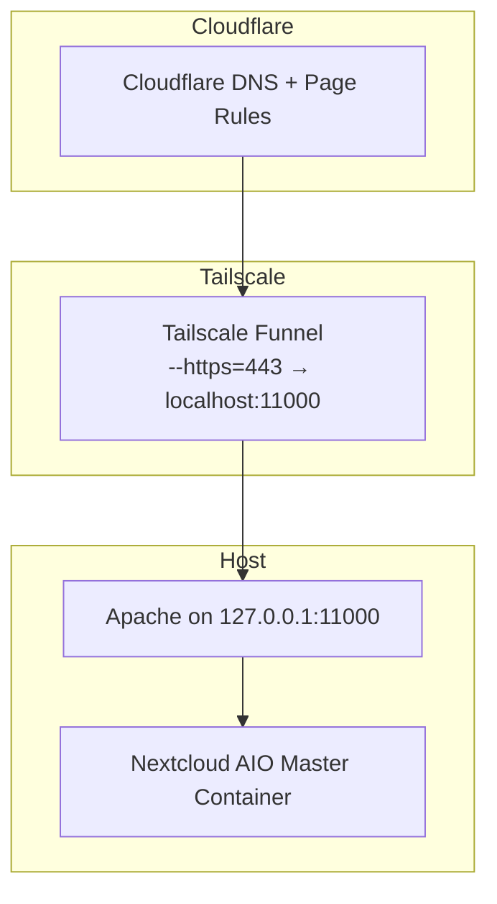

# Running NextCloud AIO on my home lab
## Overview
This project aims to get a NextCloud AIO installation up and running on my home lab, then expand on this deployment in several phases. I chose NextCloud for this project because it is a real, multi‑component application rather than a simple tutorial or “hello world” example. Working with a system that includes storage, databases, web services, background workers, and multiple deployment options gives me more realistic experience than smaller, self‑contained projects typically provide. NextCloud also supports several deployment models such as AIO, Docker Compose, Kubernetes, and fully manual setups. This gives me the flexibility to start with a simple, guided installation and gradually transition to more complex and customizable architectures as the project develops.

### The current phase structure is:

1. **Install and connect NextCloud AIO**  
   1. Set up Tailscale certificate and Funnel  
   2. Install NextCloud AIO, altering the port and skipping validation to ensure Tailscale works  
   3. Connect nc.myexample.com from Cloudflare to my Tailscale node domain  

2. **Set up monitoring and logging**  
   1. Deploy Netdata for initial observability  
   2. Add Prometheus and Grafana for long‑term metrics and dashboards  

3. **Manual Docker deployment**  
   Replace the AIO master container with a manually managed Docker deployment to increase flexibility and control over individual Nextcloud components.

4. **Kubernetes deployment**  
   Migrate the manual Docker deployment into a Kubernetes cluster to improve scalability, resilience, and orchestration.

5. **GitOps and CI/CD tooling**  
   Introduce GitOps workflows and CI/CD automation to manage configuration, deployments, and monitoring in a reproducible and declarative way.

So far, phase one is complete, and phase two has been started with Netdata deployed on the system. This document will cover phase 1 plus Netdata and expand as the project develops.

## Architecture diagram
Here is the final architecture I am using:





## Why this architecture?
I chose this architecture to take advantage of a few specific things:

1. I can utilize an existing Cloudflare domain to provide access to my Nextcloud instance. Using Tailscale Funnel lets me expose the Nextcloud interface to the internet without opening ports on my router. This helps keep my LAN secure since Tailscale encrypts everything and does not directly allow access to my network the way a port forward could. Since Tailscale handles TLS, I also had to skip Nextcloud's domain validation, which is discussed in more detail later.
2. Nextcloud's AIO container provides a guided install and automated provisioning. This enables getting the server up and running quickly as well as a stable, known good configuration to work from. The tradeoff here is making it work with Tailscale is more complex than a manual deployment would be.
3. Netdata gives me an initial monitoring layer, and its cloud dashboard provides preconfigured alerts. This helped me monitor the installation and make sure nothing goes wrong while Nextcloud is running.

## Setting things up
As discussed in my home lab architecture, I use Tailscale for networking across my home lab. Since I don't want to have my home network directly exposed, I wanted to link NextCloud to my Tailnet. Unfortunately, this presents some problems. NextCloud AIO wants very tight control over the host's ports and networking, which conflicts with Tailscale. Online resources mentioned using Tailscale serve to provide internal access to Nextcloud on your Tailnet, but not specifically for exposing NextCloud to the internet through Tailscale funnel. After a few misconfigurations and false starts, which I'll document later, I got it working.
 It turned out to be mostly using Funnel rather than Serve to expose my NextCloud machine, adjusting Apache ports and IP Bindings, and provisioning a certificate in Tailscale itself. The next step was to get Cloudflare, where my domain is hosted, to send people to my Nextcloud instance. This needed a page rule with a 301 redirect and a DNS record which Cloudflare created automatically.
 ## Setting up NextCloud AIO
 For this deployment, I picked my Ubuntu machine. It's recommended by Nextcloud itself, and Ubuntu is a stable OS with well tested updates and a long support life. I already had Docker installed and configured, so I used the docker run command recommended by Nextcloud with a few adjustments to adapt to Tailscale's networking.
 ```bash
 sudo docker run \
--sig-proxy=false \
--name nextcloud-aio-mastercontainer \
--restart always \
--publish 80:80 \
--publish 8080:8080 \
--publish 8443:8443 \
--env APACHE_PORT=11000 \
--env APACHE_IP_BINDING=127.0.0.1 \
--env SKIP_DOMAIN_VALIDATION=true \
--volume nextcloud_aio_mastercontainer:/mnt/docker-aio-config \
--volume /var/run/docker.sock:/var/run/docker.sock:ro \
ghcr.io/nextcloud-releases/all-in-one:latest
```
The key lines for making this setup work are the three --env lines. These tell Apache to listen on port 11000 from localhost, 127.0.0.1, and also to skip the domain validation. Since Tailscale handles TLS, AIO's built-in validation will fail. It is possible this command could be refined further, and I will work on this as I continue the project.
Once the container started, going to ubuntu.mytailnet.ts.net:8080 brought up the installations screen. Nextcloud accepted my tailnet node domain without issue, and the install completed normally. After the installation finished, I first opened the nextcloud interface by going to ubuntu.mytailnet.ts.net, and then from nc.myexample.com. I was able to access the installation from both domains worked, and the setup has been stable now for a few days.
## Netdata, the base of my monitoring stack
To begin building out the monitoring layer for this deployment, I installed Netdata on the host running NextCloud AIO. Since this setup exposes a public‑facing service, I wanted to have at least a minimal level of observability in place early on. Netdata provides real‑time charts for CPU usage, disk activity, network throughput, and container health, which is enough to confirm that the system is behaving normally after each change.

During the initial AIO setup, Netdata triggered several container health warnings. These turned out to be false positives caused by the temporary container restarts that occur during AIO’s installation process. Even though they were not actionable, they were useful in showing how monitoring tools can surface transient behavior that looks like a problem but is simply part of a normal deployment workflow.

As the project continues, I plan to expand the monitoring stack by adding Prometheus and integrating Netdata into it. This will allow for long‑term metrics retention and more detailed dashboards. For now, Netdata serves as a lightweight and effective starting point.

## Lessons learned
Working through this deployment highlighted several important points that will guide the next phases of the project. The first is that NextCloud AIO’s master container provides a convenient, all‑in‑one deployment, but that convenience comes with tradeoffs. AIO expects to manage ports, networking, and TLS in a very specific way, and deviating from those expectations can lead to unexpected behavior. This became clear when I initially attempted to expose the service by forwarding port 443 directly through Tailscale Funnel. That approach led me to explore Cloudflare Tunnel and other complex solutions that ultimately were not needed.

The actual solution was much simpler. Forwarding traffic to Apache on port 11000 and updating the docker run command to match aligned the configuration with what AIO expects. Once these adjustments were made, the entire ingress chain worked cleanly. This reinforced the importance of understanding the constraints of the tools involved rather than trying to force a more complicated architecture.

Another lesson was the value of verifying assumptions against official documentation. Several early issues came from adapting examples designed for internal access through Tailscale Serve rather than external access through Funnel. Serve and Funnel solve different problems, and recognizing that distinction made it easier to build a stable configuration. Returning to the documentation clarified how Funnel handles TLS termination, why AIO’s domain validation needed to be skipped, and how Apache should be bound to localhost.

Deploying Netdata early also proved useful. Even though some of the initial alerts were false positives, having visibility into the system helped confirm that the architecture was stable after each change. This will continue to be important as the project expands into more complex deployments.
## Phase one complete
I now have a successfully deployed and stable NextCloud AIO instance with a secure public-facing connection. Netdata provides a solid initial layer of monitoring, but adding Prometheus will give me more detailed metrics and historical tracking. Once that is in place, the next step will be to take Nextcloud apart and rebuild it manually without relying on AIO. I will continue updating this page as the project progresses.
