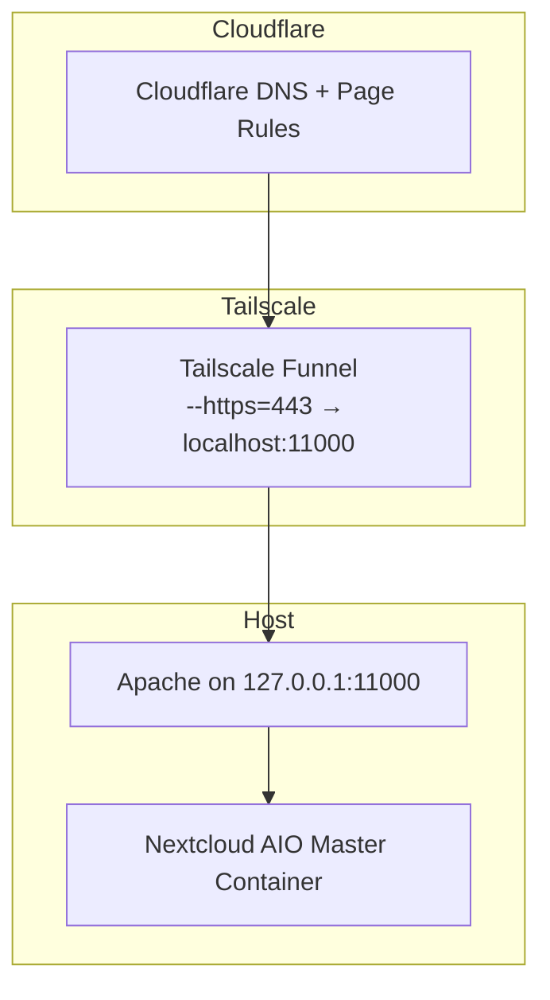

# Running NextCloud AIO on my home lab
## Overview
This project aims to get a NextCloud AIO installation up and running on my home lab, then expand on this deployment in several phases.
1. Install and connect NextCloud AIO
    1. Setup Tailscale certificate and funnel
    2. Install NextCloud AIO, altering the port and skipping validation to ensure Tailscale works
    3. Connect nc.myexample.com from Cloudflare to my Tailscale node domain.
 2. Setup monitoring and logging
     1. Set up netdata for initial observability
     2. Configure Prometheus+grafana for deeper logs and long-term observability
  3. Set up reproduceability, GitOps, Ci/CD tooling
  4. Reconfigure Nextcloud to run across all three nodes of my home lab using Docker swarm and Docker Stack.

So far, phase one is complete, and phase two has been started with Netdata deployed on the system. This document will cover phase 1, and expand as this project develops.

## Architecture diagram
Here is the final architecture I am using:

## Why this architecture?
I chose this architecture to take advantage of a few specific things:
1. I can utilize an existing cloudflare domain to provide access to my nextcloud instance. Using Tailscale funnel lets me expose the nextcloud interface to the internet without opening ports on my router. This helps keep my lan secure since Tailscale encrypts everything and does not directly allow access to my lan like a port forward could. Since tailscale handles tls, I had to also skip Nextcloud's domain validation, which is discussed in more detail later.
## Setting things up
As discussed in my home lab architecture, I use Tailscale for networking across my home lab. Since I don't want to have my home network directly exposed, I wanted to link NextCloud to my Tailnet. Unfortunately, this presents some problems. NextCloud AIO wants very tight control over the host's ports and networking, which conflicts with Tailscale. Online resources mentioned using Tailscale serve to provide internal access to Nextcloud on your Tailnet, but not specifically for exposing NextCloud to the internet through Tailscale funnel. After a few misconfigurations and false starts, which I'll document later, I got it working.
 It turned out to be mostly using Funnel rather than Serve to expose my NextCloud machine, adjusting Apache ports and IP Bindings, and provisioning a certificate in Tailscale itself. The next step was to get Cloudflare, where my domain is hosted, to send people to my Nextcloud instance. This needed a page rule with a 301 redirect and a DNS record which Cloudflare created automatically.
 ## Setting up NextCloud AIO
 For this deployment, I picked my Ubuntu machine. It's recommended by Nextcloud itself, and Ubuntu is a stable OS with well tested updates and a long support life. I already had Docker installed and configured, so I used the docker run command recommended by Nextcloud with a few adjustments to adapt to Tailscale's networking.
 sudo docker run \
--sig-proxy=false \
--name nextcloud-aio-mastercontainer \
--restart always \
--publish 80:80 \
--publish 8080:8080 \
--publish 8443:8443 \
--env APACHE_PORT=11000 \
--env APACHE_IP_BINDING=127.0.0.1 \
--env SKIP_DOMAIN_VALIDATION=true \
--volume nextcloud_aio_mastercontainer:/mnt/docker-aio-config \
--volume /var/run/docker.sock:/var/run/docker.sock:ro \
ghcr.io/nextcloud-releases/all-in-one:latest
The key lines for making this setup work are the three --env lines. These tell Apache to listen on port 11000 from localhost, 127.0.0.1, and also to skip the domain validation. Since Tailscale handles TLS, AIO's built-in validation will fail. It is possible this command could be refined further, and I will work on this as I continue the project.
Once the container started, going to ubuntu.mytailnet.ts.net:8080 brought up the installations screen. Nextcloud accepted my tailnet node domain without issue, and the install completed normally. After the installation finished, I first opened the nextcloud interface by going to ubuntu.mytailnet.ts.net, and then from to nc.myexample.com. I was able to access the installation from both domains worked, and the setup has been stable now for a few days.